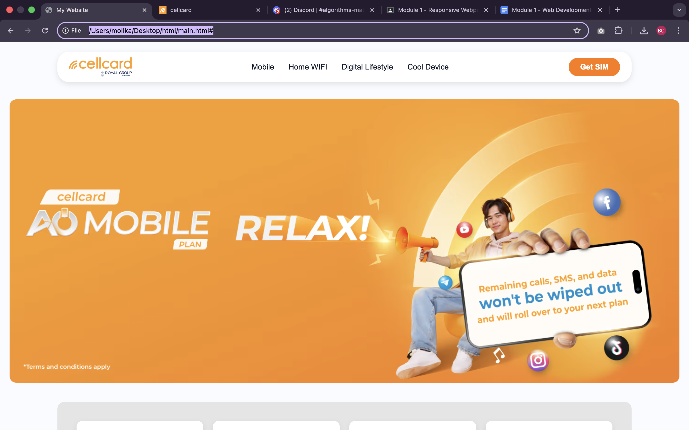
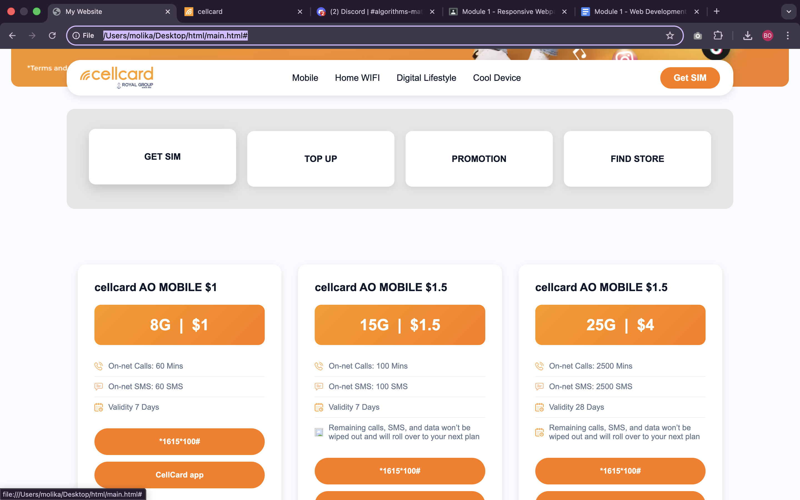
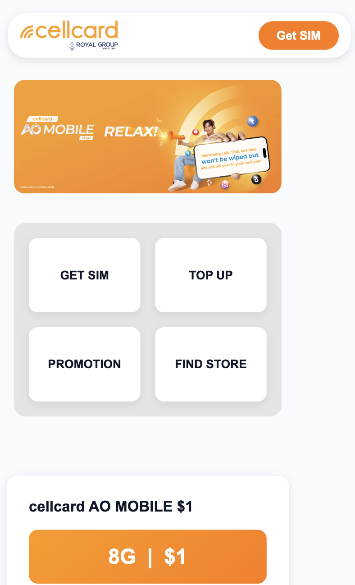
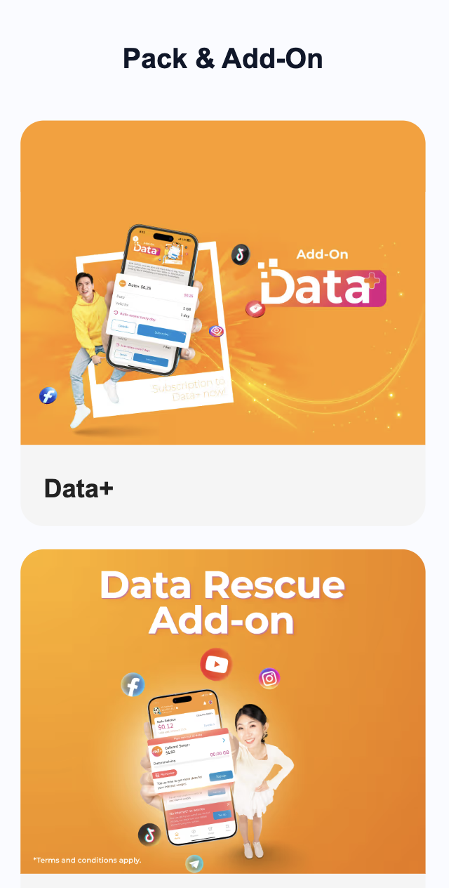

📱 Cellcard Website (HTML5 + CSS3)

This project is a fully responsive Cellcard-themed website built using pure HTML5 and CSS3. It recreates key UI sections from the official Cellcard homepage, including the navigation bar, hero banner, mobile plans, add-ons, store directory, and footer.

👉 Live Demo: https://html-wing-m1jg1qb59-molikas-projects-323783dd.vercel.app/

🚀 Technologies Used

HTML5 – clean, semantic page structure

CSS3 – styling, layout, and animations

Flexbox & CSS Grid – responsive layout system

Media Queries – optimized for mobile, tablet, and desktop

Reusable UI components – cards, buttons, layout sections

🎨 Features

✔️ Cellcard-style navigation bar

✔️ Hero banner with centered text and call-to-action

✔️ Shortcut menu section

✔️ Mobile plan cards with pricing

✔️ Add-on cards with images

✔️ Store locations displayed in a responsive grid

✔️ Fully responsive footer

✔️ Modern spacing, hover effects, and clean UI

📂 Project Structure
/project
│── index.html     # Main page  
│── styles.css     # Core styling  
│── /images        # Assets and icons  
└── /sections      # Optional grouped components

## 📸 Screenshots

▶️ How to Run

Download or clone the project.

Open index.html in any browser.

No installation or setup required.

📌 Summary

This project demonstrates the ability to build a complete, modern, and responsive website interface using only HTML5 and CSS3, closely following the visual style of the official Cellcard website. It focuses on clean structure, reusable components, and responsiveness across all screen sizes.
